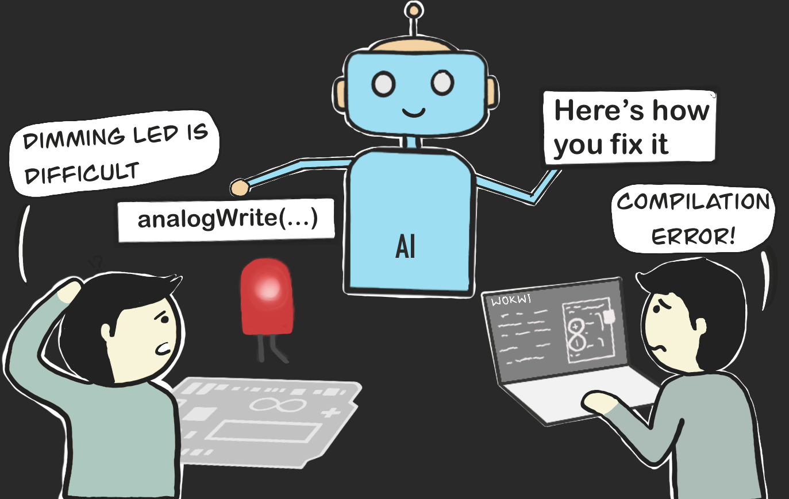

## I. Introduction

Artificial Intelligence has rapidly changed how many of us approach our problems.  For students, the accessibility of AI has been an absolute game changer for how we learn.  While most classes frown on the use of AI in assignments and learning, ICS 314 embraces AI and sees it as just another tool to be utilized. In this essay I will discuss how AI tools, methodologies, and concepts have influenced my learning and understanding of software engineering principles in ICS 314. 

## II. Personal Experience with AI:
##### 1. Experience WODs e.g. E18
- I utilized AI to explain the necessary componenets of the solution. 
  
##### 2. In-class Practice WODs
- Here I tried to complete the WODs without AI but when I got stuck, AI was helpful in guiding me in the right direction but rarely provided complete solutions.  Further refining was often essential.
  
##### 3. In-class WODs
- Early on, I avoided using AI to push myself to solve problems independently but later, I began using ChatGPT and Github Copilot for helpful hints.  Depending on the code, AI proved extremely helpful and only needed minor adjustments but other times, I felt like the AI written code was not accurate at all.  Since the in class WODs were time sensitive, I learned that while AI could be helpful, you could not completely rely on it.
  
##### 4. Essays
- AI was helpful in summarizing and phrasing ideas and concepts in an elegant way.
  
##### 5. Final project
- AI was helpful in some instances for debugging but for the most part, as our code became more involved, AI was not utilized.
  
##### 6. Learning a concept / tutorial
- AI was a helpful tool for summaries of concepts and how to utilize certain software tools.
  
##### 7. Answering a question in class or in Discord
- AI could be helpful to answer simple questions in class but I did not personally use it for Discord questions.
  
##### 8. Asking or answering a smart-question
- AI could be helpful in giving the starting point for the answers to a smart-question but it rarely gave a complete solution.
  
##### 9. Coding example e.g. “give an example of using Underscore .pluck”
- AI was helpful in basic examples but for more in-depth understandings of code it was not detailed enough. 
  
##### 10. Explaining code
- AI was helpful in explaining code and adding comments to code.
  
##### 11. Writing code
- AI provided useful pieces of code that was often used as a starting point.
  
##### 12. Documenting code
- Beyond writing basic comments to code, AI was not very helpful in this instance.
   
##### 13. Quality assurance e.g. “What’s wrong with this code <code here>” or “Fix the ESLint errors in <code here>”
- I used AI regularly for quality assurance, copying and pasting my code to try and understand what was going wrong.  It could be very hit or miss depending on the code, but I found that the more specific the prompting resulted in more helpful responses.
  
##### 14. Other uses in ICS 314 not listed
- AI was helpful when I ran into problems installing software. 

## III. Impact on Learning and Understanding:
The incorporation of AI in ICS 314 has impacted my learning and understanding in a generally positive way. AI-driven tools like ChatGpt and Github Co-Pilot played a helpful role in honing my coding skills. The instant code suggestions and completion features not only expedited coding but also began to really help me understand the code.

The application of AI in ICS 314 has challenged my understanding of software engineering concepts in a positive way. By introducing AI as a collaborative partner in the learning process, I have been prompted to critically evaluate and refine my understanding of software development engineering.

## IV. Practical Applications:
AI was utilized during my participation of the HACC this year, proving helpful to troubleshoot and write certain functions I was unfamiliar with. At my internship this summer, I was surprised to find that the software team utilized AI regularly to help them problem solve and they often encouraged me to use it to ask questions and better understand what I was working with. 

## V. Challenges and Opportunities:
While the incorporation of AI in ICS 314 has brought numerous benefits, it has not been without its challenges. One notable challenge is the potential over-reliance on AI tools, leading to a passive learning experience. Balancing the use of AI as a supplementary tool rather than a substitute for active engagement is crucial.

## VI. Comparative Analysis:
Personally, I found ICS 314's approach of utilizing AI as a tool for education more helpful than other classes that frown on it.  In terms of knowledge retention, AI tools offer the advantage of continuous reinforcement, you can continue prompting ChatGPT to further learn and understand certian concepts. And the immediate feedback provided by tools like Co-Pilot is really helpful in understanding the intracicies of code. Overall, I feel like the hands-on approach of learning with AI really helpful in understanding software engineering concepts.

## VII. Future Considerations:
As AI continues to advance, I can only imagine what impact it will have on education in the future.  While I already find AI tools helpful in ICS 314, there improvement will undoubtedly help students even more in the future.  But as said, it can be complex to determine how to ensure that students are not over-relying on these AI tools and are actually learning. 

## VII. Conclusion: 
In conclusion, the incorporation of AI in ICS 314 has been a really cool experience, influencing my learning, comprehension, and practical skills in software engineering. The practical applications of AI in real-world projects and collaborative activities underscore its effectiveness in addressing complex challenges. While challenges and opportunities exist, a reponsibile and balanced integration of AI in software engineering education holds great promise for preparing students for the dynamic landscape of the tech industry. While AI is ever evolving, an emphasis on responsible AI use and a commitment to enhancing the learning experience is essential.

