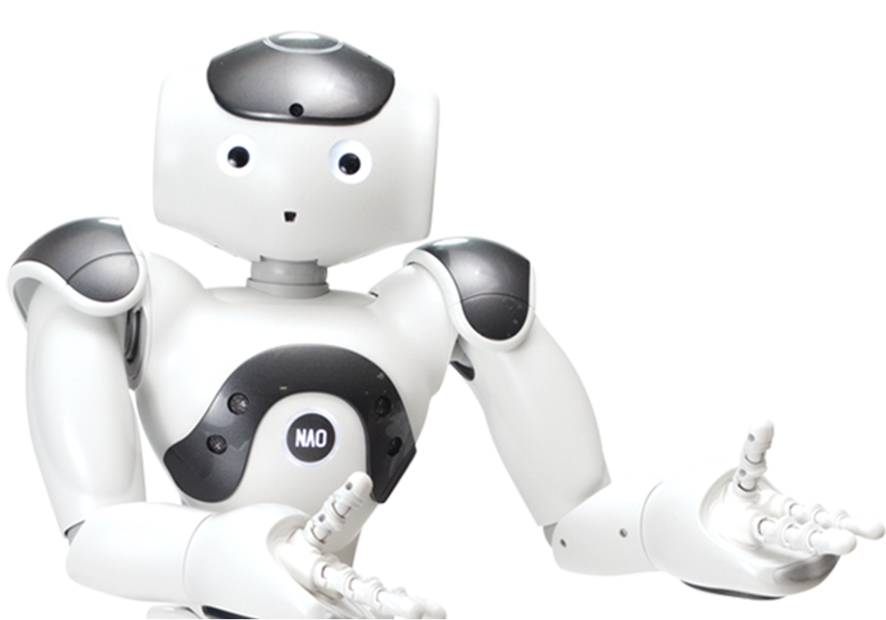

NAO robots are humanoid robots developed by Softbank Robotics. They are designed to assist with various tasks, including education, research, and entertainment, by leveraging advanced artificial intelligence and human-robot interaction capabilities.

My interest began with a specific behavior in Choregraphe (the programming software for NAO robots) called "Get Smile." This behavior served as a cornerstone for the project's aspirations. The primary goal was to leverage this behavior to create a robot capable of contributing to people's mental well-being. In essence, the idea was simple yet profound: if someone appeared sad, NAO would intervene by telling a joke or engaging in a cheerful interaction to uplift their spirits.

I used a combination of pre-existing behaviors within the Choregraphe software framework while augmenting the robot's functionality through custom Python scripting. The Python script was specifically designed to interface with a CSV file containing a list of jokes- once the behavior started, it would choose a joke at random for NAO to tell.  I then added a laugh track that would play once the joke was told.

While the concept seemed straightforward, the practical implementation turned out to be more challenging than anticipated. Several hurdles emerged during the project, shedding light on the complexities of human-robot emotional interactions.

Consistency: The foremost challenge was achieving consistency in NAO's emotional recognition and response. While the robot occasionally succeeded in delivering the intended emotional support, there were instances where it fell short of expectations. This inconsistency stemmed from the intricate nature of human emotions, which are not always expressed in a uniform manner.

Sensitivity to Sound and Lighting: NAO's sensitivity to sound and lighting conditions played a pivotal role in the success of the project. The robot's ability to accurately detect changes in a person's expression was heavily influenced by the surrounding environment. Adequate lighting conditions were imperative for reliable emotional recognition.

Source: <a href="[https://github.com/ICSatKCC/KCC-Robot-Projects/tree/main/Spring23/Sam]"><i class="large github icon ">
