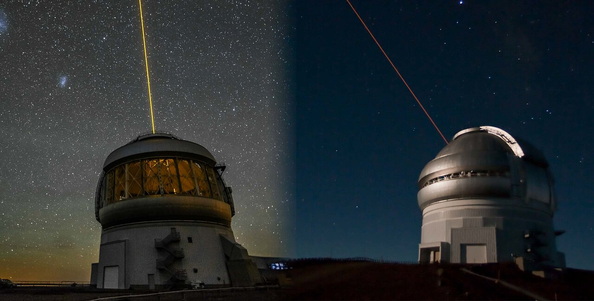

  
The Gemini Observatory consists of two twin telescopes; one located in La Serena, Chile and one located on Maunakea, Hawai’i. A vital component within this observatory is the Gemini Engineering Archive (GEA), which serves as a repository for important telescope process data. 
  
The current GEA exhibits limited user-friendliness and lacks a mechanism for accessing and visualizing log data related to the different subsystems and instruments' operations. The aim of this project was to develop the Next Generation GEA, focusing on enhancing the front-end's visual interface and adding a feature to visualize log data. 

To achieve this goal, I utilized the visualization and analytics platform Grana to create an enhanced front-end with easy-to-understand charts, graphs, and dashboards. Additionally, I used the software tools Elasticsearch, Kibana, and Logstash (ELK stack) to build a logging system. Within this ELK stack, I developed code for the individual instruments and subsystems of the telescope, constructing pipelines to transfer log data to the database. 
  
To construct the new interface for GEA, we wrote a Python script to request telemetry data from the current GEA’s server and transmit it to Grafana for visualization within a user-friendly interface. To deploy all of these operations, Docker containers were utilized to ensure the controlled execution environment of these systems. 

While I worked on building the Next Gen GEA at Gemini North, I worked closely with a duo at Gemini South in Chile who were building the same system there.  In this project, I learned about working remotely with a team which was a really cool experience.  

By implementing this Next Generation GEA, an improved understanding of the telescope's operations will be achieved, enabling scientists to easily gather data and better understand essential telescope processes.

